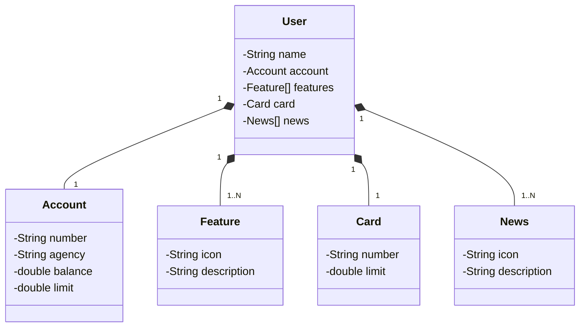
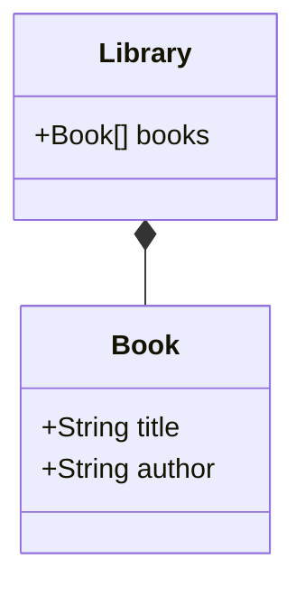

## Diagrama UML do Projeto
Usando o JSON da Abstração Inicial do Problema via UI, foi criado um diagrama de classes usando a linguagem Mermaid



## Explicação da Composição UML:

No contexto de diagramas de classes na UML (Unified Modeling Language), **composição** é um tipo de relacionamento especial entre classes que indica uma relação de “todo/parte” onde a parte não pode existir independentemente do todo.

* **Relação de Contenção**: Na composição, uma classe (o todo) contém outra classe (a parte). A parte é criada e destruída junto com o todo.
* **Dependência de Existência**: Se o objeto da classe que contém (o todo) for destruído, os objetos das classes contidas (as partes) também serão destruídos. **Isso indica uma forte dependência entre as classes.**

* **Representação Gráfica**: Em um diagrama de classes, a composição é representada por um losango preenchido na extremidade da associação que aponta para a classe que contém.

**Exemplo de Composição**: Imagine um sistema de gerenciamento de bibliotecas:

Biblioteca (Library) é a classe que contém.
Livro (Book) é a classe contida.
Se a biblioteca for destruída, todos os livros contidos nela também serão destruídos. Aqui está como isso seria representado em um diagrama de classes:



No exemplo acima, não faz sentido a classe Library existir sem a classe Book, aqui há uma forte dependência entre as classes o que é chamado de **composição**.

No digrama de classes é representado por:
```
*--
```
## Cardinalidade
A **cardinalidade** em um diagrama de classes define a quantidade de instâncias de uma classe que podem se relacionar com instâncias de outra classe. Aqui estão os tipos principais:

* 1:1 (Um para Um): Uma instância de uma classe se relaciona com uma instância de outra classe. Ou seja, em nosso projeto, apenas um usário para cada conta.

* 1:N (Um para Muitos): Uma instância de uma classe se relaciona com várias instâncias de outra classe. Já em features, tem-se uma reção um pra muitos, o que significa que uma instância de usuários pode interar com muitas instâncias de features;

* N:1 (Muitos para Um): Várias instâncias de uma classe se relacionam com uma instância de outra classe.

* N:M (Muitos para Muitos): Várias instâncias de uma classe se relacionam com várias instâncias de outra classe.

Esses tipos ajudam a entender como as classes interagem e se conectam em um sistema. Se precisar de mais detalhes, estou aqui para ajudar!

## Concluíndo
A partir do diagrama de classes é possível criar com facilidade as classes de modelo.